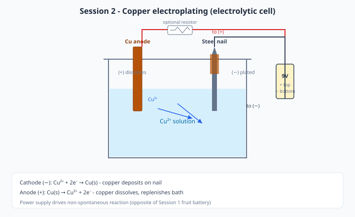

# Session 2 — Experiment: Copper Electroplating

> **Instructors:** polarity checks, deposit quality, and solution notes — [instructor.md](instructor.md).

---

## Copper solution — what to use

You need a blue **copper(II)** solution. Use either the overnight homemade bath from Session 1 or the instructor CuSO₄ backup.

### Option A — Homemade (from Session 1)

| Ingredient | Amount per jar |
|------------|----------------|
| White vinegar | ~100 mL |
| Table salt | 1–2 tsp (~5–10 g) |
| Clean copper metal | Large surface area (wire coil, gasket, or strips) |

- Started at end of Session 1; should look pale blue/green after overnight.
- If almost colorless → use Option B.

### Option B — Copper sulfate backup (instructor prepares)

**Target concentration: 0.5 M CuSO₄** (recommended classroom strength).

| Batch size | CuSO₄·5H₂O (blue crystals) | Distilled or tap water |
|------------|----------------------------|------------------------|
| 200 mL (about 2 groups) | **25 g** | Fill to 200 mL |
| 500 mL | **62 g** | Fill to 500 mL |
| 1.0 L | **125 g** | Fill to 1.0 L |

**How to mix:**

1. Weigh CuSO₄·5H₂O (copper sulfate pentahydrate — the common blue lab salt).
2. Dissolve in ~¾ of the water; stir until clear blue.
3. Add water to the final volume; label **"0.5 M CuSO₄ — Session 2 — do not drink"**.
4. Store covered; goggles/gloves when pouring.

**Acceptable range if you must improvise:** 0.25–1.0 M. Below ~0.25 M plating is slow; much above 1 M can give rough deposits and waste chemical.

**Do not add strong acid** (industrial baths sometimes use H₂SO₄ — skip that for this age group).

### Volume per group today

**50–100 mL** of copper solution in a jam jar or small beaker (enough to immerse both electrodes).

---

## Prep — Clean the cathode (25–35 min)

### Object options

Steel nail, screw, coin, washer, or key (one “good” object + optional unplated control of the same type).

### Procedure

1. Sand or steel-wool the surface until **bright metal** shows (no rust, paint, or dull oxide).
2. Rinse under water; pat dry with a paper towel.
3. **Do not touch** the area that will be plated — hold by the head, thread, or edge only. Finger oil ruins adhesion.
4. Optional: photograph or weigh before plating for comparison.

### Quality checklist

- [ ] No visible rust or grease
- [ ] Uniform bright sanded surface
- [ ] Rinsed and dry
- [ ] Placed on a clean paper towel until use

---

## Setup — Plating cell (35–50 min)

*Figure 1 — Electrolytic cell: Cu anode (+) dissolves; Cu²⁺ deposits on the nail cathode (−). Optional resistor limits current.*

### Materials at the station

- 50–100 mL copper solution (Option A or B)
- Copper strip, gasket, or thick wire (**anode**)
- Cleaned object (**cathode**)
- 9 V battery (fresh)
- Alligator clips (at least 2)
- Optional: 100–500 Ω resistor, multimeter on DC mA

### Wiring — follow exactly

| Part | Connects to |
|------|-------------|
| **Object to plate** (nail, etc.) | Battery **negative (−)** / black |
| **Copper anode** | Battery **positive (+)** / red |
| Optional resistor | In series on either lead (limits current) |
| Optional ammeter | In series on DC **mA** range |

**Memory aid:** *The object that should gain copper goes to the minus sign.*

### Procedure

1. Pour **50–100 mL** copper solution into the jar.
2. Clip the **copper anode** to battery **(+)**; clip the **object** to battery **(−)**.
3. If using a resistor: put it in series so current must pass through it.
4. If using a multimeter for current: set to DC mA; wire it **in series** (not across the battery like a voltmeter).
5. Lower both electrodes into the solution so the plating area is submerged.
6. Keep electrodes **2–4 cm apart**; they must **not touch** (touching = short circuit).
7. Confirm bubbles or a slow color change starting within ~30–60 s. Read initial current if possible (**target ~10–40 mA** with a resistor; without a resistor current may be higher).

### Pre-plating record

| Item | Value |
|------|-------|
| Solution (homemade / 0.5 M CuSO₄) | |
| Approximate concentration if known | |
| Solution volume (mL) | |
| Solution color | |
| Anode material | |
| Cathode object | |
| Electrode spacing (cm) | |
| Initial current (mA) | |
| Resistor used? (Y/N, Ω) | |

---

## Plating run (50–70 min)

1. Start the timer when the circuit is connected and current is flowing.
2. Every **1–2 minutes**, look at the object: color, shine, roughness, bubbles.
3. Typical good run: **3–8 minutes**. Stop sooner if the deposit turns black or powdery.
4. Disconnect the battery **before** removing the object.
5. Rinse gently under water; pat dry. Do not scrape the new copper.
6. Compare to an unplated control of the same object type.

### Observation log

| Time (min) | Appearance | Current (mA) | Notes |
|------------|------------|--------------|-------|
| 0 | | | |
| 2 | | | |
| 4 | | | |
| 6 | | | |
| 8 | | | |
| Final | | | |

### What “good” looks like

| Appearance | Meaning | Action |
|------------|---------|--------|
| Bright salmon / copper color | Good plating | Continue or stop at planned time |
| Dark brown / black powder | Current too high | Stop; add resistor; re-sand; restart shorter |
| Patchy | Dirty surface or poor immersion | Re-clean; ensure full immersion |
| Heavy bubbles on object | Competing H₂ evolution | Lower current / increase spacing |

---

## Variable comparisons (70–80 min)

Groups test **one** variable (share results):

| Variable | Options | What to compare |
|----------|---------|-----------------|
| Plating time | 2 vs. 8 min | Thickness, color |
| Current | With vs. without 220–470 Ω resistor | Smoothness |
| Surface prep | Clean vs. finger-greased | Adhesion, coverage |
| Solution | Homemade vs. 0.5 M CuSO₄ | Speed, color quality |
| Distance | ~1 cm vs. ~4 cm electrode gap | Uniformity, current |

### Results table (class compilation)

| Group | Variable | Result | Best practice conclusion |
|-------|----------|--------|--------------------------|
| | | | |

---

## Troubleshooting

| Problem | Cause | Fix |
|---------|-------|-----|
| No plating | Reversed polarity | Object must be on **(−)** |
| No plating | Solution too weak | Switch to 0.5 M CuSO₄ backup |
| Black/powdery Cu | Current too high | Add 100–500 Ω resistor; increase distance |
| Patchy deposit | Dirty / oily surface | Re-sand, rinse, no fingerprints |
| Anode not dissolving | Wrong anode (not copper) | Use copper strip/wire |
| Battery gets hot | Short circuit | Separate electrodes; check clips |
| Very slow plating | Low [Cu²⁺] or bad contacts | Use backup bath; clean clips |

---

## Safety during experiment

- Goggles on when working with solutions; gloves recommended
- Do not ingest solutions; no mouth pipetting
- Avoid short-circuiting the 9 V battery
- Collect all copper-bearing liquid in the labeled waste container — **not** down the drain
- Wash hands after the lab

---

## Experiment status

- [ ] 0.5 M CuSO₄ backup mixed and labeled (or homemade jars verified)
- [ ] Optimal plating time determined in pilot (record: ___ min)
- [ ] Resistor value chosen for ~10–40 mA (record: ___ Ω)
- [ ] Before/after photos for lecture use
- [ ] Variable comparison sheet printed for groups
