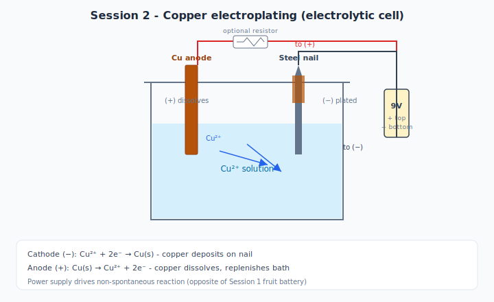

# Session 2 — Lecture: Electrolysis and Copper Plating

**Target duration:** ~20 minutes

---

## Opening hook (0–10 min)

### Demo / inspection

1. Hold up jars from Session 1 overnight prep
2. Ask: *"What changed? Why is the liquid colored? Where did the copper go?"*
3. Optional: compare weak homemade solution vs. blue CuSO₄ backup

### Guiding questions

- Is this the same as the lemon battery, or the reverse?
- Who is supplying the energy now?

---

## Core concepts (10–25 min)

### 1. Galvanic vs. electrolytic cells

| | **Galvanic (Session 1)** | **Electrolytic (Session 2)** |
|--|--------------------------|------------------------------|
| Energy | Chemical → electrical | Electrical → chemical |
| Spontaneous? | Yes | No — needs power supply |
| Anode sign | Negative (−) | Positive (+) |
| Example | Fruit battery | Copper plating |

### 2. What happens in the plating bath

- **Cathode (−):** Object to plate — Cu²⁺ ions gain electrons → **Cu metal deposits**
- **Anode (+):** Copper metal — Cu dissolves → **replenishes Cu²⁺ in solution**
- Ions carry charge through the solution; electrons through the wire and power supply

### 3. Current controls deposition rate

- More current → faster plating (more electrons per second → more Cu atoms)
- **But:** too much current → rough, dark, powdery deposit (bad current density)

### 4. Smooth vs. rough deposits

| Factor | Good deposit | Bad deposit |
|--------|--------------|-------------|
| Surface | Clean, sanded | Greasy, oxidized |
| Current | Moderate, steady | High, uncontrolled |
| Distance | Electrodes reasonably spaced | Too close → hot spots |
| Time | Enough for even layer | Too fast → tree-like growth |

### 5. Why cleaning matters

- Oil from fingers blocks electron transfer at the surface
- Oxide layers prevent adhesion
- **Rule:** Sand → rinse → handle by edges only → plate immediately

---

## Wrap-up discussion (80–90 min)

- Why must the object connect to the **negative** terminal?
- What would happen with a steel anode instead of copper?
- How is this related to manufacturing (chrome on bumpers, gold on jewelry)?

---

## Visual aids to prepare

- [ ] Side-by-side: fruit battery vs. plating cell (energy direction arrows)
- [ ] Photo series: 0 min, 2 min, 5 min plating on nail
- [ ] Examples of rough vs. smooth copper (if available from pilot)

---

## Vocabulary

- [ ] Electrolysis
- [ ] Electrolyte / electrolytic cell
- [ ] Cathodic deposition
- [ ] Anodic dissolution
- [ ] Current density

---

## Bridge to Session 3

*"We moved copper atoms today without counting them. Next session we **plate silver** and use **Faraday's law** to calculate exactly how many atoms we deposited — and how thick the film is."*
