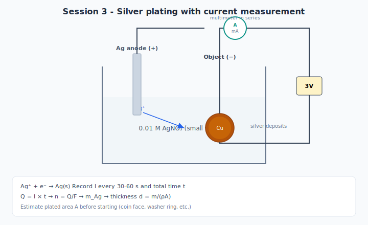

# Session 3 — Experiment: Silver Plating + Calculations

---

## Part A — Estimate surface area (25–35 min)

### Object options

Copper coin, copper washer, cleaned brass charm, small flat piece

### Methods

**Coin ( cylinder face ):**
- Measure diameter d → A = π(d/2)² (one face) or ×2 for both faces if fully immersed

**Flat washer:**
- Outer and inner diameter → A ≈ π(R_outer² − R_inner²)

**Irregular object:**
- Approximate as rectangle: length × width of immersed region

### Record

| Dimension | Value (cm) | Formula used | Area A (cm²) |
|-----------|------------|--------------|--------------|
| | | | |

---

## Part B — Setup (35–45 min)



*Figure 1 — Plate the cathode object (−); measure current with the multimeter in series for Faraday calculations.*

**Preferred:** 3 V battery pack (9 V can work but less ideal)

### Procedure

1. Pour **small volume** (~20–30 mL) of 0.01 M AgNO₃ — use minimum needed
2. Clean cathode object (sand, rinse, dry)
3. Connect **multimeter in series** on current (DC mA) range
4. Cathode = object (−); anode = silver wire/strip (+) if available
5. Verify current before full immersion — target modest current (~10–30 mA)

### Setup record

| Item | Value |
|------|-------|
| Object | |
| Area A (cm²) | |
| Solution volume (mL) | |
| Anode type | |
| Target plating time (s) | |

---

## Part C — Timed plating run (45–65 min)

1. Start stopwatch when stable current flows
2. Record current every **30–60 s**
3. Run for planned duration (e.g. 300 s = 5 min)
4. Disconnect; rinse object; pat dry
5. Observe: color, uniformity, mirror-like vs. dull

### Current log

| Time (s) | I (A or mA) | Notes |
|----------|-------------|-------|
| 0 | | |
| 60 | | |
| 120 | | |
| 180 | | |
| 240 | | |
| 300 | | |

**Average current:** I_avg = ______ A

---

## Part D — Faraday calculations (65–80 min)

Use **I_avg** and total time **t** (seconds).

| Step | Formula | Your calculation | Result |
|------|---------|------------------|--------|
| 1. Charge | Q = I_avg × t | | C |
| 2. Moles e⁻ | n_e = Q / 96,485 | | mol |
| 3. Moles Ag | n_Ag = n_e | | mol |
| 4. Mass Ag | m = n_Ag × 107.87 | | g |
| 5. Volume Ag | V = m / 10.49 | | cm³ |
| 6. Thickness | d = V / A | | cm → **µm** |

### Convert thickness to micrometers

d (µm) = d (cm) × 10,000

---

## Part E — Compare to reality (80–90 min)

Discussion prompts:

1. Can you **see** a layer ~0.5–1 µm thick?
2. If current dropped during the run, did you use average I correctly?
3. What side reactions might steal electrons?
4. Would doubling the time double the thickness (ideal case)?

### Optional: efficiency estimate

If a balance is available:

η = (actual mass gained / calculated mass) × 100%

---

## Safety

- **Gloves and goggles mandatory** — AgNO₃ stains skin and clothing permanently
- Small volumes only
- Dedicated silver waste container — **never** pour down drain
- Instructor prepares/dilutes AgNO₃ stock

---

## Student calculation sheet (duplicate for handout)

```
Given: I_avg = _____ A,  t = _____ s,  A = _____ cm²

Q = I × t = __________ C
n_e = Q / 96485 = __________ mol
m_Ag = n_e × 107.87 = __________ g
d = m_Ag / (10.49 × A) = __________ cm = __________ µm
```

---

## Experiment status

- [ ] AgNO₃ diluted and labeled
- [ ] Typical current at 3 V recorded in pilot
- [ ] Worksheet tested with sample numbers
- [ ] Silver waste protocol confirmed with facility
