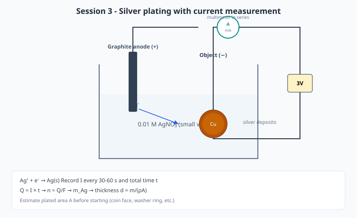

# Session 3 — Experiment: Silver Plating + Calculations

> **Instructors:** area pitfalls, ammeter series wiring, I_avg — [instructor.md](instructor.md).

---

## Silver nitrate solution — concentration and prep

**Target working solution: 0.01 M AgNO₃** (instructor prepares before class).

**Water: use distilled or deionized water only.** Tap water often contains chloride, which precipitates AgCl (cloudy white) and can ruin a dilute silver bath. Rinse plated objects with distilled water too.

| Batch | Solid AgNO₃ needed | Distilled water |
|-------|--------------------|-----------------|
| 100 mL of 0.01 M | **0.17 g** AgNO₃ | Fill to 100 mL |
| 250 mL of 0.01 M | **0.42 g** AgNO₃ | Fill to 250 mL |
| 500 mL of 0.01 M | **0.85 g** AgNO₃ | Fill to 500 mL |

(Molar mass AgNO₃ ≈ 169.9 g/mol → 0.01 mol/L × 169.9 ≈ 1.70 g/L.)

### If you have a more concentrated stock

Example: dilute **0.1 M** stock **1:10** → 0.01 M  
(e.g. 25 mL of 0.1 M + 225 mL **distilled** water = 250 mL of 0.01 M).

### Volume per group today

**20–30 mL** of 0.01 M AgNO₃ — use the minimum that covers the object. Do not prepare large open beakers of AgNO₃ at student benches.

### Labeling

`0.01 M AgNO₃ — Session 3 — gloves required — silver waste only`

---

## Part A — Estimate surface area (25–35 min)

### Object options

Copper coin, copper washer, cleaned brass charm, or small flat copper piece.

### Methods

**Coin (one face):**  
Measure diameter \(d\) in cm → \(A = \pi (d/2)^2\).  
If both faces plate, use \(A = 2\pi (d/2)^2\).

**Flat washer:**  
\(A \approx \pi(R_\text{outer}^2 - R_\text{inner}^2)\) (one side), or ×2 if both sides plate.

**Irregular object:**  
Approximate immersed region as length × width (cm × cm). State the approximation in your notes.

### Record

| Dimension | Value (cm) | Formula used | Area A (cm²) |
|-----------|------------|--------------|--------------|
| | | | |

**Tip:** A typical coin face is ~2–4 cm². If your A is 50 cm², you probably measured wrong — recheck before calculating thickness.

---

## Part B — Setup (35–45 min)



*Figure 1 — Plate the cathode object (−); measure current with the multimeter in series for Faraday calculations.*

### Power supply

| Preferred | Acceptable |
|-----------|------------|
| **3 V** battery pack | 9 V with short runs and careful current checks |

Target current: **~10–30 mA** (0.010–0.030 A).

### Procedure

1. Put on **gloves and goggles**.
2. Pour **20–30 mL** of **0.01 M AgNO₃** into a small beaker or jar.
3. Clean the cathode object: sand → rinse with distilled water → dry → handle with forceps/gloves only.
4. Wire the circuit **in series**:
   - Battery (+) → anode (silver wire/strip if available; otherwise an inert conductor — note that Ag⁺ will deplete)
   - Anode in solution → solution → object
   - Object (−) → multimeter **mA** input → battery (−)  
   Or: battery → meter → object → solution → anode → battery.
5. Set multimeter to **DC mA** (not voltage). The meter must be **in series**, never clipped across the battery terminals alone.
6. Brief test: dip electrodes; confirm current is in the 10–30 mA range. If much higher, lift electrodes partially or use 3 V instead of 9 V.

### Setup record

| Item | Value |
|------|-------|
| Object | |
| Area A (cm²) | |
| AgNO₃ concentration | **0.01 M** |
| Solution volume (mL) | |
| Anode type | |
| Supply voltage | |
| Target plating time (s) | e.g. **300 s** |
| Initial current (mA) | |

---

## Part C — Timed plating run (45–65 min)

1. Start the stopwatch when a **stable** current is flowing with the object immersed.
2. Record current every **30–60 s** for the planned time (recommend **300 s = 5 min**).
3. If current drifts, keep logging — you will use the average.
4. At stop time: disconnect power first, then remove the object.
5. Rinse with distilled water; pat dry. Observe color and uniformity.

### Current log

| Time (s) | I (mA) | I (A) = mA ÷ 1000 | Notes |
|----------|--------|-------------------|-------|
| 0 | | | |
| 60 | | | |
| 120 | | | |
| 180 | | | |
| 240 | | | |
| 300 | | | |

**Average current:**  
I_avg (mA) = ______ → I_avg (A) = ______ **A**  
(Example: 20 mA = **0.020 A**)

---

## Part D — Faraday calculations (65–80 min)

Use **I_avg in amperes** and total time **t in seconds**.

Constants for silver:

| Quantity | Value |
|----------|-------|
| Faraday constant F | 96,485 C/mol |
| Molar mass Ag | 107.87 g/mol |
| Density ρ_Ag | 10.49 g/cm³ |
| Electrons per Ag⁺ | **z = 1** |

| Step | Formula | Your calculation | Result |
|------|---------|------------------|--------|
| 1. Charge | Q = I_avg × t | | C |
| 2. Moles e⁻ | n_e = Q / 96,485 | | mol |
| 3. Moles Ag | n_Ag = n_e (because z = 1) | | mol |
| 4. Mass Ag | m = n_Ag × 107.87 | | g |
| 5. Volume Ag | V = m / 10.49 | | cm³ |
| 6. Thickness | d = V / A | | cm |
| 7. Micrometers | d_µm = d_cm × 10,000 | | **µm** |

### Worked check example (board / instructor)

I = 0.020 A, t = 300 s, A = 10 cm² → Q = 6.0 C → n = 6.22×10⁻⁵ mol → m ≈ 0.0067 g → d ≈ **0.64 µm**.

---

## Part E — Compare to reality (80–90 min)

Discussion prompts:

1. Can you **see** a layer ~0.5–1 µm thick?
2. If current dropped, did you use **I_avg**?
3. What side reactions might steal electrons (e.g. H₂)?
4. Would doubling the time double the thickness in the ideal case?

### Optional: efficiency estimate

If a balance (±0.001 g) is available:

η = (actual mass gained / calculated mass) × 100%

---

## Safety

- **Gloves and goggles mandatory** — AgNO₃ stains skin and clothing permanently dark brown/black
- Small volumes only (20–30 mL per group)
- Dedicated **silver waste** container — **never** pour down the drain
- Instructor prepares/dilutes AgNO₃; students do not handle solid AgNO₃
- Wash gloves/hands protocol as directed before leaving

---

## Student calculation sheet (duplicate for handout)

```
Given: I_avg = _____ A,  t = _____ s,  A = _____ cm²
AgNO₃ bath: 0.01 M

Q = I × t = __________ C
n_e = Q / 96485 = __________ mol
m_Ag = n_e × 107.87 = __________ g
d = m_Ag / (10.49 × A) = __________ cm = __________ µm
```

---

## Experiment status

- [ ] 0.01 M AgNO₃ prepared and labeled (volume: ___ mL)
- [ ] Typical current at 3 V recorded in pilot (___ mA)
- [ ] Worksheet tested with sample numbers
- [ ] Silver waste protocol confirmed with facility
