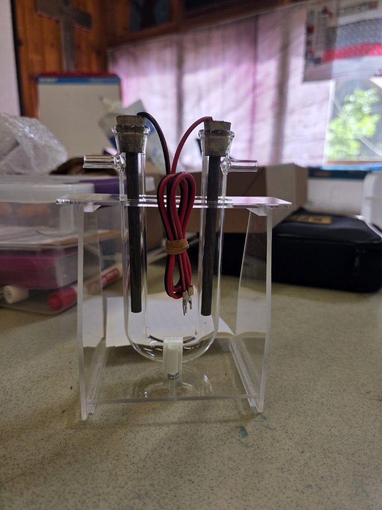

# Session 4 — Lecture: Water Electrolysis and Stoichiometry

**Target duration:** ~20 minutes (+ energy discussion at end)

> **Instructors:** half-reactions, why no NaCl, 2:1 ratio errors, derusting handoff — [instructor.md](instructor.md).

---

## Opening hook (0–10 min)

Show the Hoffman-style **U-tube** with graphite electrodes (or the photo in [experiment.md](experiment.md)).

*"One limb makes hydrogen. One makes oxygen. Which side will fill **twice as fast**? Why?"*

---

## Core concepts (10–25 min)

### 1. Electrolysis of water

- Pure water conducts poorly → add **sodium sulfate (Na₂SO₄)** as supporting electrolyte (**NOT NaCl**)
- Power supply forces non-spontaneous reaction: water → hydrogen + oxygen

### 2. Half-reactions (simplified)

**Cathode (−):** water reduced → **hydrogen gas**  
**Anode (+):** water oxidized → **oxygen gas**

### 3. Stoichiometry — the 2:1 ratio

From overall equation: **2H₂O → 2H₂ + O₂**

- **2 volumes H₂ : 1 volume O₂** (same T and P)
- Avogadro: 2 moles H₂ : 1 mole O₂

### 4. The U-tube cell

- Two graphite electrodes in a glass U-tube (side arms; stoppers at the top)
- Gases collect in each limb; compare column heights / volumes
- Red (+) = anode = O₂; black (−) = cathode = H₂

### 5. Why observed ratio may differ from 2:1

- O₂ slightly more soluble in water than H₂
- Small bubbles escape through side arms
- Leaks, uneven electrode areas
- Still a strong qualitative and semi-quantitative demo

---

## Energy discussion (75–85 min)

### Hydrogen as energy storage

1. **Excess renewable electricity** (solar/wind) → electrolysis → H₂
2. Store H₂ (compressed, or other methods — brief mention)
3. Later: **fuel cell** converts H₂ + O₂ back to electricity + water

**Key idea:** Hydrogen is an **energy carrier**, not a primary energy source — energy is lost at each step.

### Efficiency chain (qualitative)

Solar → electricity → H₂ → storage → fuel cell → electricity → motor/light  
(Each arrow loses some energy as heat)

---

## Preview Session 5 (85–90 min)

*"We used electricity to **make** hydrogen. Overnight we'll use electricity to **undo** rust on iron. Tomorrow: reveal the results, then connect corrosion, galvanic cells, and sacrificial protection."*

Start derusting cells per [experiment.md](experiment.md) Part E before students leave.

---

## Visual aids

- [ ] Balanced equation with mole/volume ratio highlighted
- [ ] Photo of setup with gas volumes marked
- [ ] Simple energy diagram: renewable → H₂ → (optional fuel cell concept)

---

## Vocabulary

- [ ] Electrolysis (applied to water)
- [ ] Stoichiometry / mole ratio
- [ ] Water displacement
- [ ] Energy carrier vs. energy source

---

## Safety talking points (brief in lecture, detailed in experiment)

- **Never use saltwater** — chlorine gas risk
- No open flames near apparatus
- Pop test: instructor only, tiny H₂ volume
