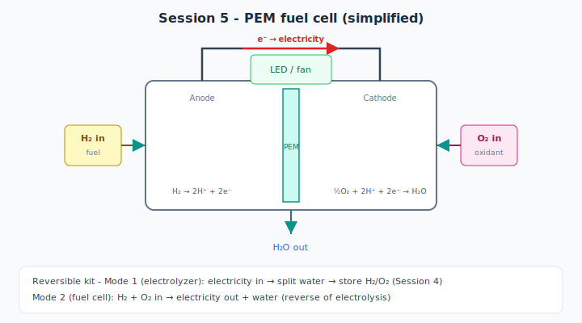

# Session 5 — Experiment: Corrosion + Fuel Cell

Two-part lab: **Part A & B** (student hands-on), **Part C** (instructor-led or supervised demo with kit).

---

## Part A — Metal-pair galvanic cells (25–45 min)

*Figure 1 — Spontaneous cell: Zn corrodes (anode), Cu is cathode; measure ~1.1 V with a multimeter.*

### Setup

Saltwater solution (~5–10% NaCl or strong saltwater — **for corrosion demo only, NOT for Session 4 electrolysis**)

Each pair: two different metals + multimeter in saltwater

### Pairs to test

| Pair | Predicted anode (corrodes) | Predicted voltage |
|------|---------------------------|-------------------|
| Zn + Cu | Zn | ~1.1 V |
| Fe + Cu | Fe | ~0.8 V |
| Al + Cu | Al | ~1.0 V |
| Zn + Fe | Zn | lower |

### Procedure

1. Partially immerse two metal strips in saltwater (not touching each other)
2. Connect multimeter to measure voltage
3. Record sign: which metal is positive on meter?
4. Identify anode (oxidizing) from activity series

### Data table

| Metal 1 | Metal 2 | V (V) | (+) terminal on | Anode (corroding) |
|---------|---------|-------|-----------------|-------------------|
| Zn | Cu | | | |
| Fe | Cu | | | |
| Al | Cu | | | |
| | | | | |

---

## Part B — Corrosion comparisons (45–55 min)

*Figure 2 — Jar B: iron rusts faster when coupled to copper. Jar C: zinc sacrificially protects iron.*

### Three jars (can start earlier in week for visible rust)

| Jar | Contents | Expected over days |
|-----|----------|-------------------|
| A | Iron nail alone in saltwater | Rust |
| B | Iron + **copper** touching in saltwater | **Faster** iron corrosion |
| C | Iron + **zinc** touching in saltwater | Iron protected; zinc corrodes |

### Today's task

1. Observe jars (same day or pre-rusted from earlier setup)
2. Compare rust color, bubble formation, metal appearance
3. Explain using galvanic cell model

### Observation sheet

| Jar | Iron appearance | Partner metal | Galvanic couple? | Which corrodes? |
|-----|-----------------|---------------|------------------|-----------------|
| A | | — | | |
| B | | Cu | | |
| C | | Zn | | |

**Optional prep:** Set up jars B and C at start of week for dramatic rust by Session 5.

---

## Part C — PEM fuel cell demo (55–70 min)

*Figure 3 — Fuel cell mode: H₂ + O₂ → electricity + H₂O (reverse of Session 4 electrolysis).*

**Use commercial educational reversible PEM kit only** — not homemade.

### Mode 1 — Electrolyzer (like Session 4)

1. Add distilled water per kit instructions
2. Connect to small solar panel or battery pack
3. Run until small H₂/O₂ stored in kit reservoirs (follow kit times)

### Mode 2 — Fuel cell

1. Disconnect power supply
2. Connect kit output to small fan, LED, or motor
3. Observe operation until gas depleted

### Class observations

| Mode | Energy in | Energy out | Chemical change |
|------|-----------|------------|-----------------|
| Electrolyzer | Electricity | H₂ + O₂ stored | Water split |
| Fuel cell | H₂ + O₂ | Electricity | Water formed |

### Discussion while running

- How is this like Session 1? Session 4?
- Why can't the fuel cell run forever?
- Where does the energy ultimately come from (solar/battery)?

---

## Part D — Compare operations (70–80 min)

Students complete comparison table (worksheet):

| Feature | Fruit battery | Electroplating | Water electrolysis | Fuel cell |
|---------|---------------|----------------|--------------------|-----------|
| Needs external power? | | | | |
| Produces electricity? | | | | |
| Gas involved? | | | | |
| Metal transferred? | | | | |

---

## Final challenge worksheet

See [lecture.md](lecture.md) — Final challenge questions.

---

## Safety

- Saltwater corrosion jars: gloves optional; wash hands after
- Fuel cell: follow manufacturer limits; no open flames
- Small H₂ volumes in kit only — no student pop tests today unless instructor repeats Session 4 protocol

---

## Experiment status

- [ ] PEM kit charged/tested before class
- [ ] Corrosion jars prepared (same-day or multi-day)
- [ ] Metal strips cleaned and labeled
- [ ] Final worksheet printed
