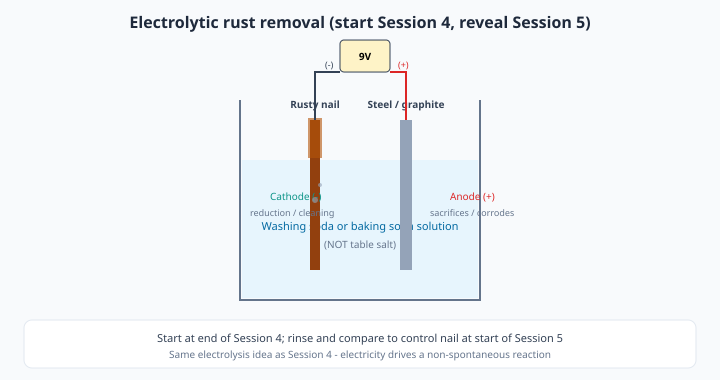

# Session 5 — Experiment: Corrosion and Electrolytic Rust Removal

**Part C** opens the session (overnight reveal). **Parts A & B** are student hands-on.

> **Instructors:** jar narratives, metal-pair voltages, reveal protocol — [instructor.md](instructor.md).

---

## Solutions used today — concentrations

### Derusting bath (started Session 4 — for reveal)

| Ingredient | Amount |
|------------|--------|
| Washing soda (Na₂CO₃) preferred | **1 tbsp (~15 g) per ~250 mL** warm water |
| or baking soda (NaHCO₃) | **1 tbsp per ~250 mL** warm water |

**No NaCl.** Tap water is fine for derusting baths.

### Saltwater for galvanic / corrosion demos only

| Ingredient | Amount |
|------------|--------|
| Table salt (NaCl) | **25–50 g per 500 mL water** |
| Water | 500 mL tap water |

≈ **5–10% w/v NaCl** (“strong saltwater”). Tap water is fine.  
Label clearly: **"CORROSION / GALVANIC ONLY — NOT for electrolysis or derusting"**.

---

## Part C — Electrolytic rust removal reveal (0–15 min)

*Figure 1 — Cells started at end of Session 4: rusty iron on cathode (−), sacrificial anode on (+), in washing soda or baking soda solution.*

### Reminder of overnight setup

1. Jar with washing soda or baking soda solution (recipe above).
2. **Cathode (−):** rusty iron nail or hardware.
3. **Anode (+):** sacrificial steel strip or graphite.
4. 9 V battery left running overnight (or until Session 5).
5. Control: rusty nail in plain water, no power.

### Today's reveal procedure

1. **Disconnect** the battery before touching electrodes.
2. Remove the treated nail with forceps or gloves; rinse under water.
3. Compare side-by-side with the control and the before photo.
4. Note: cathode bubbles (H₂ possible), anode darkening/sludge, bath cloudiness.
5. Discuss spontaneous rust (jars) vs driven cleaning (this cell).

### Observation sheet

| Sample | Electrolyte | Power overnight? | Appearance after rinse | Cleaner than control? |
|--------|-------------|------------------|------------------------|----------------------|
| Treated nail | Washing soda / baking soda | Yes | | |
| Control nail | Water only | No | | |
| Sacrificial anode | — | Yes | | |

### Discussion prompts

- Which electrode was the **cathode**? What happens there?
- How is this like Session 4 electrolysis?
- How is this **opposite** of jar B (Fe + Cu) corrosion?

---

## Part A — Metal-pair galvanic cells (25–45 min)

*Figure 2 — Spontaneous cell: Zn corrodes (anode), Cu is cathode; measure ~1.1 V with a multimeter.*

### Setup

1. Pour **~50–100 mL** of **5–10% saltwater** into a small jar.
2. Clean metal strips lightly with sandpaper if heavily oxidized.
3. For each pair: immerse both metals so they do **not touch** in solution.
4. Multimeter on DC volts: probe one metal with red, the other with black.
5. Record voltage and which metal is at the **+** meter terminal.

### Pairs to test

| Pair | Predicted anode (corrodes) | Typical voltage (order of magnitude) |
|------|---------------------------|--------------------------------------|
| Zn + Cu | Zn | ~0.9–1.1 V |
| Fe + Cu | Fe | ~0.5–0.8 V |
| Al + Cu | Al (may be suppressed by oxide) | variable |
| Zn + Fe | Zn | lower than Zn–Cu |

### Procedure tips

- Keep immersion depth similar across trials.
- If voltage is near zero, check that metals are not shorted and that saltwater is strong enough.
- Wipe electrodes between trials to reduce cross-contamination.

### Data table

| Metal 1 | Metal 2 | V (V) | (+) terminal on | Anode (corroding) |
|---------|---------|-------|-----------------|-------------------|
| Zn | Cu | | | |
| Fe | Cu | | | |
| Al | Cu | | | |
| Zn | Fe | | | |

---

## Part B — Corrosion comparisons (45–55 min)

*Figure 3 — Jar B: iron rusts faster when coupled to copper. Jar C: zinc sacrificially protects iron.*

### Jar recipes (set up earlier in the week if possible)

Use the same **5–10% saltwater** in each jar (~100–150 mL per jar).

| Jar | Contents | Expected over days |
|-----|----------|-------------------|
| A | Iron nail alone | Gradual rust |
| B | Iron + **copper** wire/strip **touching** the iron | **Faster** iron rust |
| C | Iron + **zinc** (or galvanized nail) **touching** the iron | Iron protected; zinc corrodes |

**Contact matters:** metals must touch (or be clipped together) so electrons can flow.

### Today's task

1. Observe jars A/B/C (multi-day or same-day start).
2. Compare rust color, cloudiness, bubbles, metal appearance.
3. Explain with the galvanic model (activity series).
4. Link to Part C: sacrificial anode idea (Zn in jar C vs steel anode in derusting).

### Observation sheet

| Jar | Iron appearance | Partner metal | Galvanic couple? | Which corrodes? |
|-----|-----------------|---------------|------------------|-----------------|
| A | | — | | |
| B | | Cu | | |
| C | | Zn | | |

---

## Part D — Compare operations (70–80 min)

| Feature | Fruit battery | Electroplating | Water electrolysis | Rust removal |
|---------|---------------|----------------|--------------------|--------------|
| Needs external power? | | | | |
| Produces electricity? | | | | |
| Gas involved? | | | | |
| Metal transferred? | | | | |
| Reverses corrosion? | | | | |

---

## Final challenge worksheet

See [lecture.md](lecture.md) — Final challenge questions.

---

## Safety

- Saltwater corrosion demos: wash hands after; optional gloves
- Keep saltwater **away** from any leftover Session 4 electrolysis tubs
- Derusting: washing soda/baking soda only — **no NaCl**
- Disconnect powered cells when the room is unsupervised
- No open flames near gas-evolving setups

---

## Experiment status

- [ ] Derusting cells started Session 4 with documented electrolyte recipe
- [ ] Control nail and before photo ready
- [ ] 5–10% saltwater mixed and labeled for galvanic/corrosion only
- [ ] Corrosion jars prepared (same-day or multi-day)
- [ ] Metal strips cleaned and labeled
- [ ] Final worksheet printed
