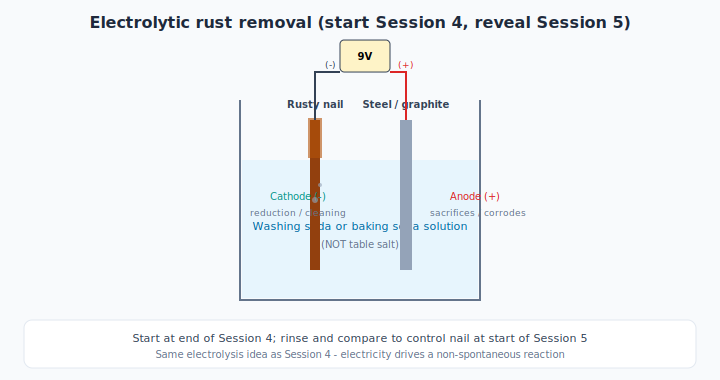

# Session 5 — Lecture: Corrosion, Galvanic Cells, and Electrolytic Rust Removal

**Target duration:** ~20 minutes (+ 10 min synthesis at end)

---

## Opening hook (0–15 min)

*Conducted with [experiment.md](experiment.md) Part C — reveal overnight derusting cells.*

Display:

- Treated vs. control rusty nails (from Session 4 setup)
- Corrosion jars A/B/C
- Shiny galvanized nail
- Copper wire
- Optional: photo of ship hull with sacrificial anode

*"Last session we used electricity to split water. Overnight we used the same idea to **undo** rust. Why does iron rust faster when it touches copper — and how can we force the reaction the other way?"*

---

## Core concepts (15–30 min)

### 1. Galvanic cells — back to Session 1

When two different metals connect in an **electrolyte** (moisture, saltwater):

- More **active** metal → **anode** (oxidizes, corrodes)
- Less active metal → **cathode** (protected)
- Electrons flow through the metal contact → measurable **voltage**

**Activity series snippet (more reactive → oxidizes first):**

Mg > Al > Zn > Fe > Cu (simplified for class)

### 2. Corrosion

- Rust = iron oxidation in presence of water and oxygen
- **Galvanic corrosion:** iron + copper in saltwater → iron corrodes **faster**
- **Sacrificial protection:** zinc corrodes instead of iron (galvanizing, hull anodes)

### 3. Sacrificial anodes

- Blocks of zinc/magnesium attached to steel structures
- Zinc is more active → becomes anode → corrodes preferentially
- Used on ships, pipelines, water heaters

### 4. Electrolytic rust removal — reversing corrosion

| | **Galvanic corrosion** | **Electrolytic derusting** |
|--|------------------------|----------------------------|
| Driven by | Spontaneous metal activity difference | External power supply |
| Iron | Corrodes (anode in couple) | **Cathode** — rust reduced |
| Partner metal | Copper cathode protects itself | Sacrificial **anode** corrodes |
| Electrolyte | Often saltwater (demo) | Washing soda or baking soda — **not NaCl** |

**Key idea:** Same electrolysis principle as Session 4 — electricity forces a non-spontaneous reaction. At the cathode, rust is reduced toward clean iron; H₂ may evolve.

### 5. Fuel cells — brief concept (optional, no demo)

Session 4 stored energy in **H₂**. A **fuel cell** could convert H₂ + O₂ back to electricity + water (reverse of electrolysis). Hydrogen is an **energy carrier** — round-trip efficiency is always < 100%. We skip the PEM kit demo; the rust-removal cell shows the same "electricity drives chemistry" idea on a visible timescale.

---

## Synthesis — Final challenge (80–90 min)

Ask the class (whole-group or worksheet):

1. Which experiment **made** electricity?
2. Which **consumed** electricity?
3. Which **moved metal atoms**?
4. Which **split molecules**?
5. Which explained **corrosion**?
6. Which **reversed** corrosion?
7. Where did **electrons** flow? Where did **ions** flow?
8. What was **oxidized**? What was **reduced**?
9. Which experiment is most relevant to **renewable energy**?

### Answer key (instructor)

| Question | Session(s) |
|----------|------------|
| Made electricity | 1, 5 (galvanic) |
| Consumed electricity | 2, 3, 4, 5 (rust removal) |
| Moved metal atoms | 2, 3 |
| Split molecules | 4 |
| Corrosion | 5 |
| Reversed corrosion | 5 (electrolytic derusting) |
| Renewable energy link | 4 (H₂ storage concept) |

---

## Visual aids

- [ ] Activity series chart with arrows showing anode/cathode
- [ ] Diagram: ship with sacrificial anode
- [ ] Before/after photos of derusted nails
- [ ] Week-at-a-glance timeline (5 sessions)

---

## Vocabulary (week review)

- [ ] Galvanic vs. electrolytic cell
- [ ] Sacrificial anode
- [ ] Energy carrier
- [ ] Oxidation / reduction (every session)

---

## Closing message

*"Electrochemistry is everywhere: phone batteries, car rust, chrome plating, hydrogen buses, and the lemon you measured on day one. Same ideas — electrons, ions, and the drive toward lower energy."*
